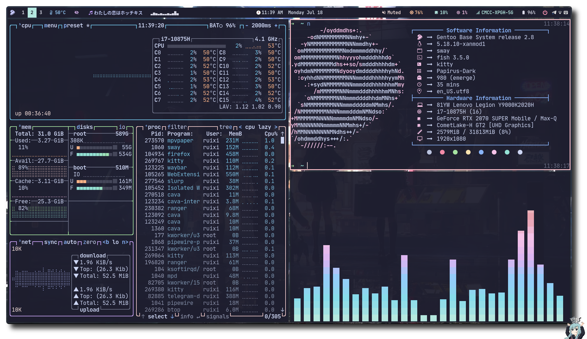
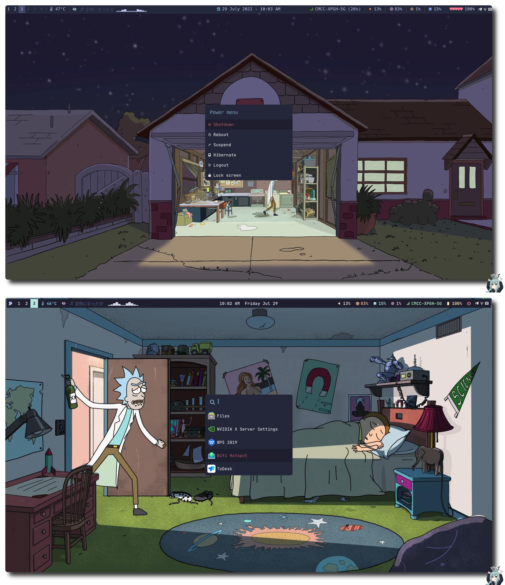

<h2 align="center">
 <b style="font-size:24px;line-height:24px;vertical-align:middle;"><i>Ruixi-rebirth sway-dotfiles</i></b>
</h2>
<p align=center style="margin-top:36px">	  
  
  
  
  
    
</p>
<p align="center"><b>My favorite themes are</b></p>
<div style="margin:0 auto;width:120px">
<table align="center" cellpadding="0" cellspacing="0">
  <tr>
      <td style="border:none;">
      
      </td>
      <td style="border:none;">
      
      </td>
  </tr>
</table>
</div>
<p align="center">

</p>
<p align="center">

</p>


<details style="font-size:1.5em;line-height:1.43">
<summary><b>🧑🏾‍🎨 ScreenShot <span style="font-size:14px;">(Click to expend) </span> </b> </summary>








</details>

### 🗒️ Info

|Program|Name|
| - | :--: |
|**Window Manager**|[Sway](https://github.com/swaywm/sway)|
|**Terminal Emulator**|[Kitty](https://github.com/kovidgoyal/kitty)|
|**Bar**|[waybar](https://github.com/Alexays/Waybar)|
|**Application Launcher**|[Rofi](https://github.com/davatorium/rofi)|
|**Notification Daemon**|[Dunst](https://github.com/dunst-project/dunst), [Mako](https://github.com/emersion/mako)|
|**Display Manager**|None|
|**network management tool**|[NetworkManager](https://networkmanager.dev/)|
|**Input method framework**|[Fcitx5](https://github.com/fcitx/fcitx5)|
|**System resource monitor**|[Btop](https://github.com/aristocratos/btop)|
|**File Manager**|[Ranger](https://github.com/ranger/ranger), [Nautilus](https://wiki.gnome.org/action/show/Apps/Files?action=show&redirect=Apps%2FNautilus)|
|**Lockscreen**|[Swaylock-effects](https://github.com/mortie/swaylock-effects)|
|**Shell**|[Fish](https://github.com/fish-shell/fish-shell)|
|**Shell Framework**|[Oh-My-Fish](https://github.com/oh-my-fish/oh-my-fish)|
|**Music Player**|[mpd](https://github.com/MusicPlayerDaemon/MPD), [ncmpcpp](https://github.com/ncmpcpp/ncmpcpp), [mpc](https://github.com/MusicPlayerDaemon/mpc), [Netease-cloud-music-gtk](https://github.com/gmg137/netease-cloud-music-gtk)|
|**Media Player**|[mpv](https://github.com/mpv-player/mpv)|
|**Text Editor**|[Neovim](https://github.com/neovim/neovim)|
|**GTK Theme**|[Catppuccin](https://github.com/catppuccin/gtk)|
|**Icons**|[Papirus Dark](https://github.com/PapirusDevelopmentTeam/papirus-icon-theme)|
|**Fonts**|[Nerd fonts](https://github.com/ryanoasis/nerd-fonts)|

### 🔨 Dependencies
#### Packages
  - sway
  - waybar
  - rofi
  - sway-effects
  - mako
  - pulseaudio
  - light
  - kitty
  - mpd
  - mpc
  - ncmpcpp
  - nm-applet
#### Fonts
  - nerd-fonts noto twemoji noto-cjk
 
### 🚀 Manual Installation
1. **Clone this repository**
```bash
 git clone https://github.com/Ruixi-rebirth/sway-dotfiles.git
```
2. **Install the required software**(see [Dependencies](#))

3. **Install firefox theme**

> Set **toolkit.legacyUserProfileCustomizations.stylesheets** to **true** in **about:config**
>> Catppuccin 
  ```bash
   # first step 
   $ cd sway-dotfiles && cp -r chrome.catppuccin $HOME/.mozilla/firefox/*.default-release/
   
   # second step
   # go to this(https://github.com/catppuccin/firefox) repository and choose your favorite color  
  ```

>> Nord 
  ```bash
    # fist step
    $ cd sway-dotfiles && cp -r chrome.nord $HOME/.mozilla/firefox/*.default-release/ 
  ```
4. **Install GTK theme**
> I use the **lxappearance** tool to set gtk themes, mouse styles, icons, etc. Although it will not take effect, it can help me generate **gtk2.0** and **gtk3.0** related configuration files. What really works is **the part of the sway config about setting the gtk theme**,In order to **apply the gtk theme to the qt program**, you should download the **qtstyleplugins** and set the environment variable **QT_QPA_PLATFORMTHEME=gtk2**
>> Catppuccin

```bash
# for a single user 
$ cd sway-dotfiles && cp -r .themes $HOME/
```
### 🔑 Keybinds 
These are the basic keybinds. Read through the sway config for more keybinds.
|        Keybind         |                 Function                 |
| ---------------------- | ---------------------------------------- |
| `Alt + Enter`          | Launch terminal (kitty)                  |
| `Alt + Shift + Enter`  | Launch floating terminal (kitty)         |
| `Alt + Shift + p`      | Kill focused window                      |
| `Alt + '`              | Set vertical orientation                 |
| `Alt + ;`              | Set horizontal orientation               |
| `Win(Super)`           | Launch Rofi                              |
| `Alt + Win(Super)`     | Launch Poer menu                         |
| `Alt + Shift + x`      | Lock screen                              |
| `Alt + O`              | Toggle Waybar                            |
| `Alt + Shift + e`      | Exit sway                                |
| `Alt + Shift + c`      | Restart sway                             |

### Star History
[](https://star-history.com/#Ruixi-rebirth/sway-dotfiles&Date)
